# Command Crawler Coursework
## Welcome to my Dungeon Crawler Game
The goal of the game is to move your character to the goal.
On your way you could collect coins and fight monsters

## Icons
- "#" are walls which cannot be passed
- "." are empty spaces which can be passed
- "M" are monsters which drop coins and in advanced mode can move and attack the player 
(Monsters can eat coins and become Boss monsters that appear as a darker red)
- "C" are coins which can be passed or picked up 
(Brighter yellow coins are worth more and drop from Boss Monsters)
- "D" is the goal
- "@" is you the player

## Advanced Behaviour
###### Game behaviour when advanced mode is active
- "advanced" can be input before starting the game to turn on advanced mode
- Monsters can perform the actions attack player, eat coins and move 
(In order of the priority of actions)
- The player can press Q to attack monsters 
(Attacks from player deal 1 damage to all monsters in cardinal directions)
- Advanced map can be loaded

###### Specific monster behaviour
- Monsters get 1 action when game is started
- Monsters will do 1 action after player has done an action
- Monsters can attack in orthogonal or diagonal directions
- Monsters will always attack player for 1 damgage if they can 
(This would be there action and is top priority)
- Monsters will always eat coins if they are next to them 
(This would be there action and is the 2nd priority)
- Monsters will randomly move to available empty spaces 
(This would be there action and is the 3rd priority)
- Monsters have 1 HP

## Extra Behaviour
- Monsters can eat coins and become boss monsters 
(Boss monsters show as a darker red and when killed drop treasure coins)
(Boss monsters cannot eat more coins)
- Monsters drop coins when killed 
(Boss monsters drop treasure which is worth 2, the coin of its death and the coin it picked up)
- Boss monsters have 3 damage points
- Attacks from player deal 1 HP to all monsters in cardinal directions
- Player starts with 2HP and heals 1 when they pickup coins 
(Treasure is worth 2 coins so heals 2)
- When the exit has been reached menu appears to replay, restart or quit the game 
(The menu also displays if the player dies)

## Controls
###### **To startup the game **

Run the Crawler.exe file

What the game looks like on startup

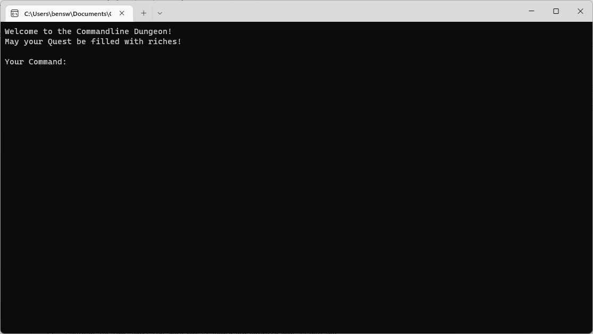

###### **To load a map**

Type load and then the name of your map to load it 
(e.g. load Simple.map)

What the game looks like when map is loaded
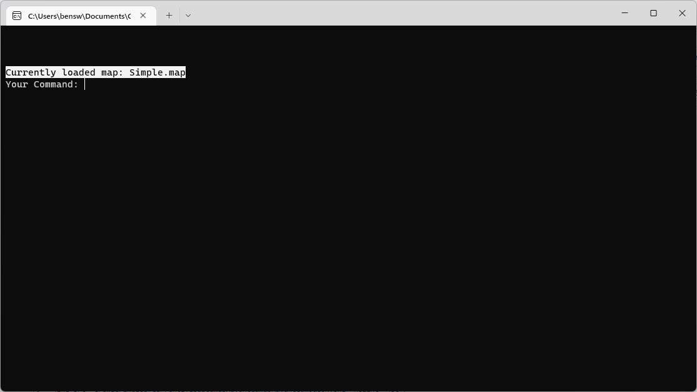

###### **To enter advanced mode**

Either before or after a loading map type "advanced" to toggle advanced mode on/off

What the game looks like when map is loaded and advanced mode is on
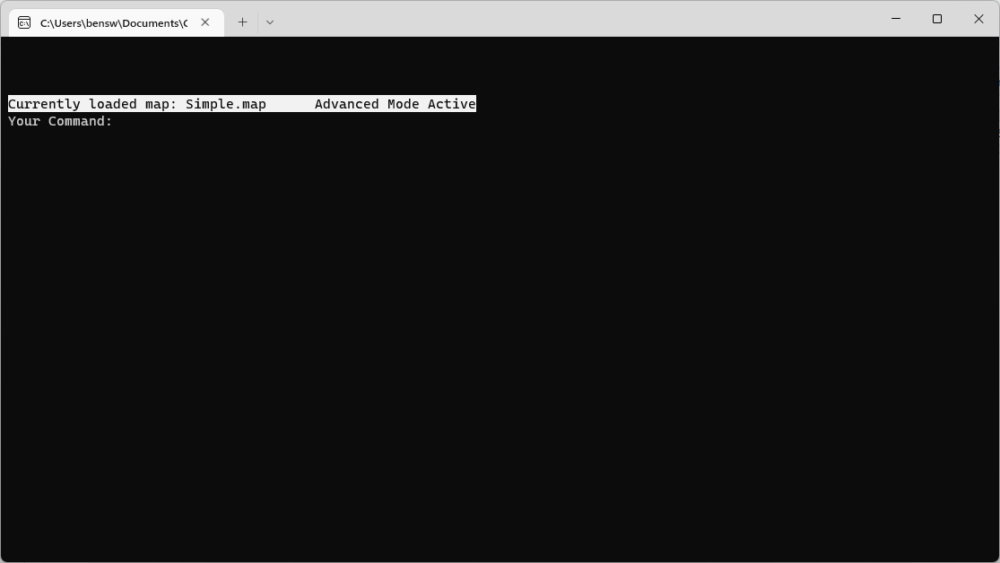
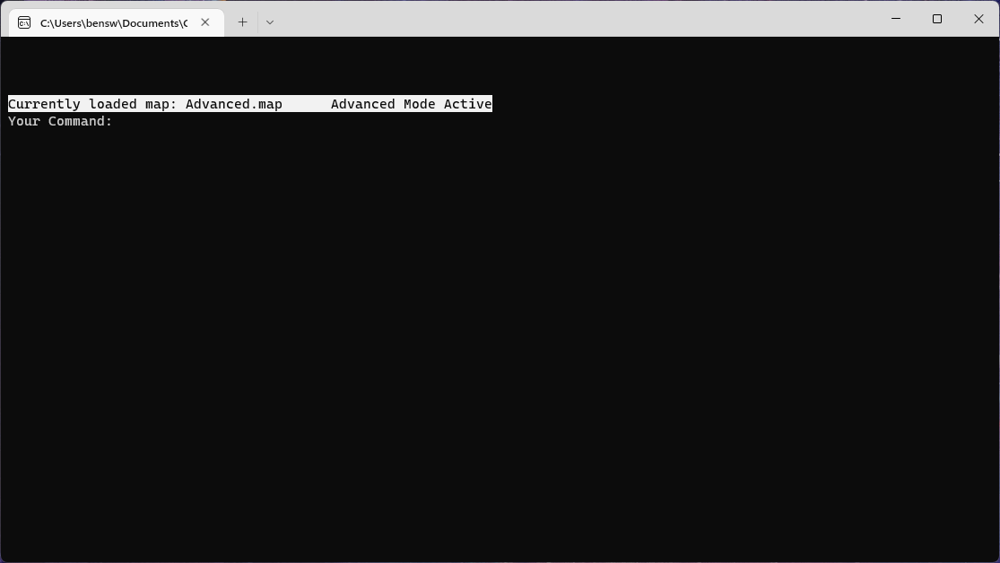

###### **To start the game**

Once a map has been loaded type "start" to start the game

What the game looks like when the game has started
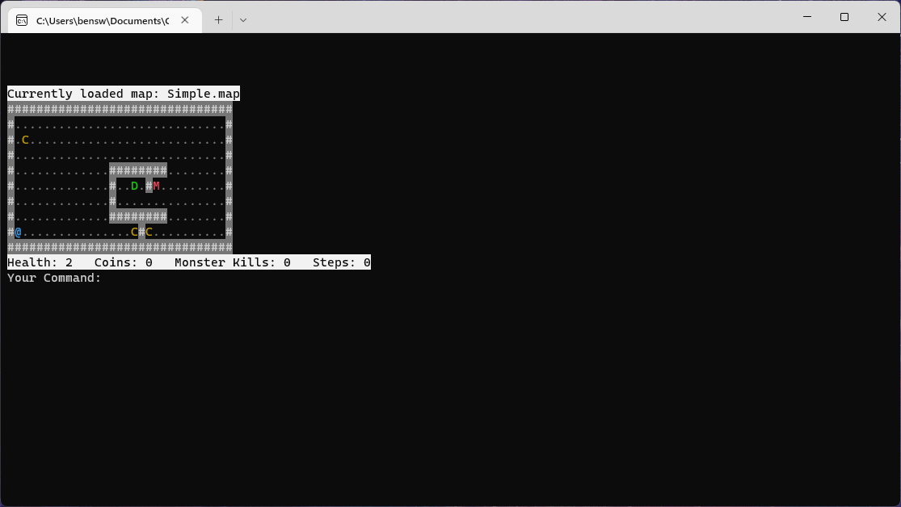
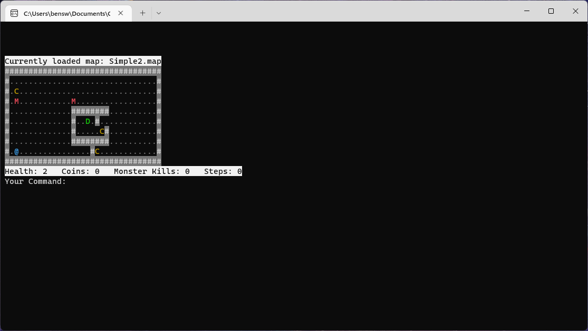
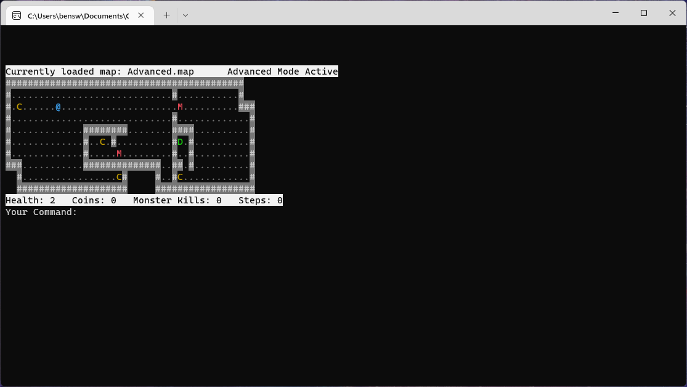

###### **While game is running**

Controls for the player are as follows
- "W" to move up
- "A" to move left
- "S" to move down
- "D" to move right
- "Z" while ontop of coin to pick it up
- "Q" while orthogonally adjacent to monsters to attack them

(Enter doesn't need to be pressed when action is made)

What the game looks like while the game is running
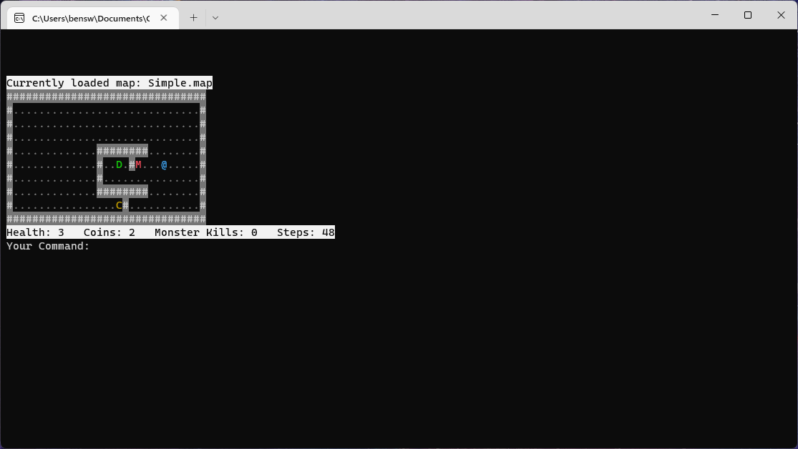
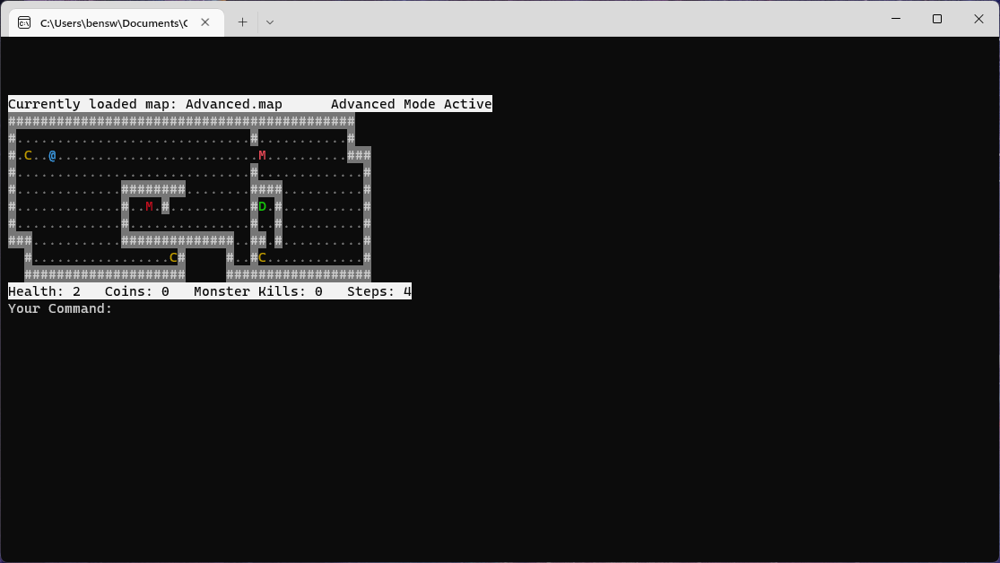
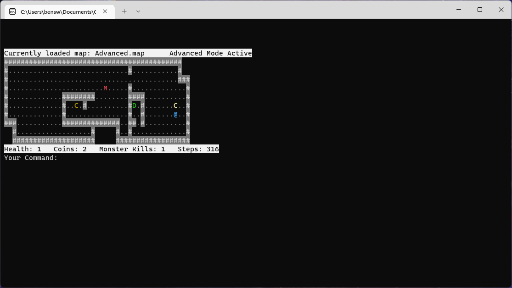

###### **When the game has ended**

When the player has reached the goal (Congradulations) or (YOU LOSE!) the end menu apears
Type:
- "replay" to replay the current map
- "restart" to load new game 
(This allows you to load a new map and enable advanced mode)
- "quit" to close the game

What the end menu looks like

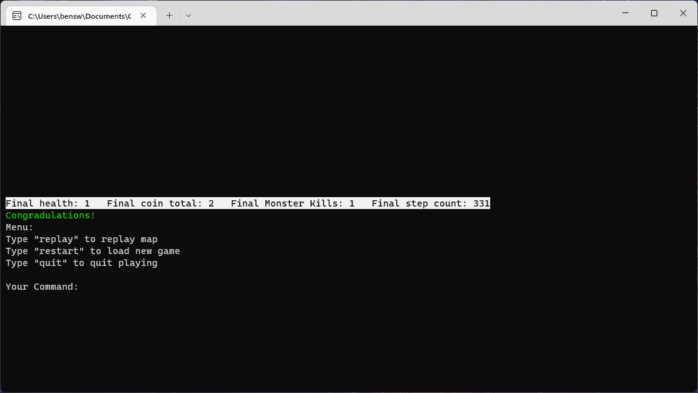
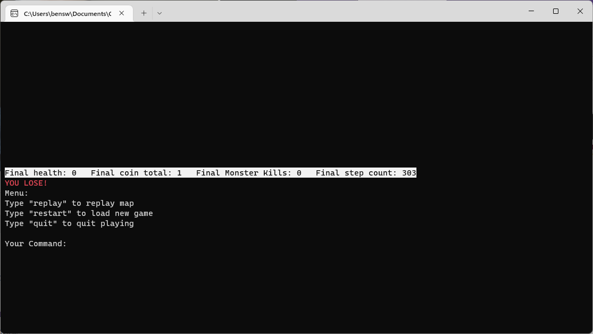

Link to video: 
https://youtu.be/pz68JwjFflc

